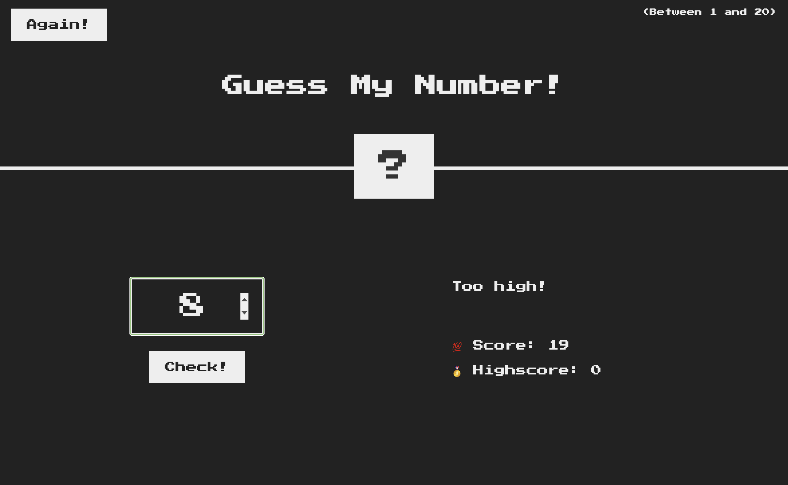

# 🎲 Guess My Number!

A simple and fun number guessing game built with HTML, CSS, and JavaScript!

Try to guess the secret number between **1 and 20**. Each wrong guess lowers your score by 1. Can you beat your own highscore?



---

## 🔹 Features

- 🎯 Random number between 1 and 20
- 🧠 Live feedback based on your guess
- 💯 Score tracking
- 🥇 Highscore system
- 🎨 Simple and clean UI
- 🔁 "Again" button to reset the game

---

## 🚀 How to Play

1. Type a number between 1 and 20 into the input box.
2. Click **Check!**
3. The game will tell you if your guess is too high 📈, too low 📉, or correct 🎉.
4. Try to keep your **score** high and beat your **highscore**!

---

## 🛠️ Tech Stack

- HTML5
- CSS3
- JavaScript (Vanilla)

---

## 📦 Run Locally

1. Clone the repo:

   ```bash
   git clone https://github.com/golsavl/guess-my-number.git
   ```

2. Open the `index.html` file in your browser:

   ```bash
   cd guess-my-number
   open index.html
   ```

   *(Use `start index.html` on Windows or drag-drop the file into any browser)*
   
---

## 👩‍💻 Author

Made with ❤️ by [Golsa Valizadeh](https://github.com/golsavl)

---

## 📄 License

This project is open-source and free to use under the [MIT License](LICENSE).
